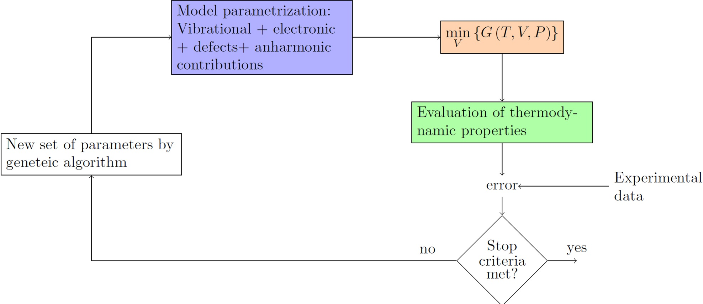

.. Debye Tools documentation master file, created by
   sphinx-quickstart on Tue Nov  9 14:35:19 2021.
   You can adapt this file completely to your liking, but it should at least
   contain the root `toctree` directive.

==========================================
Welcome to ``debyetools``'s documentation!
==========================================

``debyetools`` is a set of tools written in Python_
for the calculation of thermodynamic properties. It's a library in The Python Package Index (PyPI_).
The software presented here is based in the Debye approximation of the QHA using the crystal internal energetics parametrized at ground-state, (go to :ref:`input file formats <fileformats>` to see how DFT calculations results can be used as inputs) to project the :ref:`thermodynamics properties <thermoprops>` at high temperatures.
We present here how each contribution to the free energy are considered and a description of the architecture of the calculation engine and of the :ref:`GUI`.

The code_ is freely available under the GNU Affero General Public License.

.. _PyPI: https://pypi.org/project/debyetools/
.. _Python: https://www.python.org/
.. _code: https://github.com/jjofres/debyetools
.. _`source code`: https://github.com/jjofres/debyetools
.. _`10.1016/j.calphad.2023.102624`: https://doi.org/10.1016/j.calphad.2023.102624

How to cite:
============

If you use  ``debyetools`` in a publication, please refer to the `source code`_.  If you use the implemented method for the calculation of the thermodynamic properties, please cite the following publication:

Jofre, J., Gheribi, A. E., & Harvey, J.-P. Development of a flexible quasi-harmonic-based approach for fast generation of self-consistent thermodynamic properties used in computational thermochemistry. Calphad 83 (2023) 102624. doi: `10.1016/j.calphad.2023.102624`_.

.. code-block::

   @article{,
      author = {Javier Jofré and Aïmen E. Gheribi and Jean-Philippe Harvey},
      doi = {10.1016/j.calphad.2023.102624},
      issn = {03645916},
      journal = {Calphad},
      month = {12},
      pages = {102624},
      title = {Development of a flexible quasi-harmonic-based approach for fast generation of self-consistent thermodynamic properties used in computational thermochemistry},
      volume = {83},
      year = {2023},
   }

Calculate quality thermodynamic properties in a flexible and fast manner:
#########################################################################

It's possible to couple the Debye model to other algorithms, to :ref:`fit experimental data <Cp_ga_example>` and in this way use data available to calculate other properties like thermal expansion, free energy, bulk modulus among many others.

   ``debyetools`` coupled to a Genetic Algorithm.

.. figure:: ./source/api/images/Cp_LiFePO4.jpeg
   :align:   center
   :width: 50%

   Heat capacity of LiFePO4 calculated with ``debyetools`` and compared to other methods.

The prediciton of :ref:`thermodynamic phase equilibria at high pressure <PvT_example>` can be performed by simultaneous parameter adjusting to experimental heat capacity and thermal expansion at P = 0.

.. _PvT:
.. figure::  ./source/api/images/Mg2SiO4_PvT.jpeg
   :align:   center
   :width: 50%

   Phase diagram P versus T for the α, β and γ forms of Mg2SiO4. Symbols are literature data for the phase stability regions
   boundaries.

Using ``debyetools`` through the GUI:
#####################################

``debyetools`` is a Python_ library that also comes with a graphical user interface to help perform quick calculations without the need to code scripts.

.. _tProps_prop:

   ``debyetools`` property viewer.

Using ``debyetools`` as a Python_ library. Example: Al fcc using Morse Potential:
#################################################################################

Using ``debyetools`` as a Python_ library adds versatility and expands its usability.

EOS parametrization:

>>> import debyetools.potentials as potentials
>>> from debyetools.aux_functions import load_V_E
>>> V_data, E_data = load_V_E('/path/to/SUMMARY', '/path/to/CONTCAR')
>>> params_initial_guess = [-3e5, 1e-5, 7e10, 4]
>>> formula = 'AlAlAlLi'
>>> cell = np.array([[4.025,0,0],[0,4.025488,0],[0,0,4.025488]])
>>> basis = np.array([[0,0,0],[.5,.5,0],[.5,0,.5],[0,.5,.5]])
>>> cutoff, number_of_neighbor_levels = 5, 3
>>> Morse = potentials.MP(formula, cell, basis, cutoff,
...                       number_of_neighbor_levels)
>>> Morse.fitEOS(V_data, E_data, params_initial_guess)
array([-3.26551e+05,9.82096e-06,6.31727e+10,4.31057e+00])

Calculation of the electronic contribution:

>>> from debyetools.aux_functions import load_doscar
>>> from debyetools.electronic import fit_electronic
>>> p_el_inittial = [3.8e-01,-1.9e-02,5.3e-04,-7.0e-06]
>>> E, N, Ef = load_doscar('/path/to/DOSCAR.EvV.',list_filetags=range(21))
>>> fit_electronic(V_data, p_el_inittial, E, N, Ef)
array([1.73273079e-01,-6.87351153e+03,5.3e-04,-7.0e-06])

Poisson's ratio:

>>> import numpy as np
>>> from debyetools . poisson import poisson_ratio
>>> from debyetools.aux_functions import load_EM
>>> EM = load_EM( 'path/to/OUTCAR')
>>> poisson_ratio ( EM )
0.2 2 9 41 5 49 8 67148558

Free energy minimization:

>>> from debyetools.ndeb import nDeb
>>> from debyetools import potentials
>>> from debyetools.aux_functions import gen_Ts,load_V_E
>>> m = 0.021971375
>>> nu = poisson_ratio (EM)
>>> p_electronic = fit_electronic(V_data, p_el_inittial, E, N, Ef)
>>> p_defects = [8.46, 1.69, 933, 0.1]
>>> p_anh, p_intanh = [0,0,0], [0, 1]
>>> V_data, E_data = load_V_E('/path/to/SUMMARY', '/path/to/CONTCAR')
>>> eos = potentials.BM()
>>> peos = eos.fitEOS(V_data, E_data, params_initial_guess)
>>> ndeb = nDeb (nu , m, p_intanh , eos , p_electronic , p_defects , p_anh )
>>> T = gen_Ts ( T_initial , T_final , 10 )
>>> T, V = ndeb.min_G (T,  1e-5, P=0)
>>> V
array([9.98852539e-06, 9.99974297e-06, 1.00578469e-05, 1.01135875e-05,
       1.01419825e-05, 1.02392921e-05, 1.03467847e-05, 1.04650048e-05,
       1.05953063e-05, 1.07396467e-05, 1.09045695e-05, 1.10973163e-05])

Evaluation of the thermodynamic properties:

>>> trprops_dict=ndeb.eval_props(T,V)
>>> tprops_dict['Cp']
array([4.02097531e-05, 9.68739597e+00, 1.96115210e+01, 2.25070513e+01,
       2.34086394e+01, 2.54037595e+01, 2.68478029e+01, 2.82106379e+01,
       2.98214145e+01, 3.20143195e+01, 3.51848547e+01, 3.98791392e+01])

FS compound database parameters:

>>> from debyetools.fs_compound_db import fit_FS
>>> T_from = 298.15
>>> T_to = 1000.1
>>> FS_db_params = fit_FS(tprops_dict, T_from,T_to)
>>> Fs_db_params['Cp']
array([ 3.48569519e+01, -2.56558596e-02, -6.35562885e+05,  2.65035585e-05])

.. toctree::
   :maxdepth: 2
   :caption: Content:

   source/api/installation
   source/api/gui
   source/api/examples
   source/api/nDeb
   source/api/contributions
   source/api/fsdb
   source/api/pairanalysis
   source/api/fileformats

=======
Indices
=======

* :ref:`genindex`
* :ref:`modindex`
