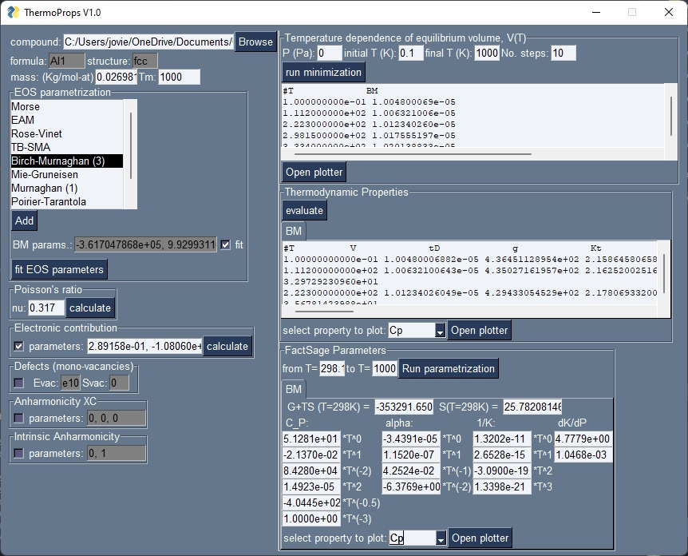

.. _examples:

=============
More examples
=============

.. contents:: Table of contents
   :local:
   :backlinks: none
   :depth: 3

Face centered cubic Aluminum thermodynamic properties
=====================================================

In order to calculate the thermodynamic properties of an element or compound, we need first to parametrize the function that will describe the internal energy of the system.
In this case we have chosen the Birch-Murnaghan equation of state and fitted it against DFT data loaded using the ``load_V_E`` function.
The ``BM`` object instantiates the representation og the EOS and its derivatives. In the module ``potentials`` there are all the implemented EOS.
The method ``fitEOS`` with the option ``fit=True`` will fit the EOS parameters to (Volume,Energy) data using ``initial_parameters`` as initial guess.
The following is an example for `Al fcc`.

.. code-block:: python

    from debyetools.aux_functions import load_V_E
    import debyetools.potentials as potentials

    V_DFT, E_DFT = load_V_E('./tests/inpt_files/Al_fcc', './tests/inpt_files/Al_fcc/CONTCAR.5', units='J/mol')
    initial_parameters =  [-3.6e+05, 9.9e-06, -7.8e+10, 4.7e+00, 1.e-10]
    eos_BM = potentials.BM()
    eos_BM.fitEOS(V_DFT, E_DFT, initial_parameters=initial_parameters, fit=True)
    p_EOS = eos_BM.pEOS
    print(p_EOS)

This will print:

.. code-block:: python

    [-3.61704789e+05  9.92993115e-06  7.61861944e+10  4.59192465e+00]

To fit the electronic contribution to eDOS data we can load them as `VASP` format `DOSCAR` files using the function ``load_doscar``.
Then, at each ``V_DFT`` volume, the parameters of the electronic contribution will be fitted with the ``fit_electronic`` function from the ``electronic`` module, using ``p_el_inital`` as inital parameters.

.. code-block:: python

    from debyetools.aux_functions import load_doscar
    from debyetools.electronic import fit_electronic

    p_el_inittial = [3.8027342892e-01, -1.8875015171e-02,
                     5.3071034596e-04, -7.0100707467e-06]
    E, N, Ef = load_doscar('./tests/inpt_files/Al_fcc/DOSCAR.EvV.')
    p_electronic = fit_electronic(V_DFT, p_el_inittial,E,N,Ef)
    print(p_electronic)

This will print:

.. code-block:: python

    [ 2.89157792e-01 -1.08059850e+04  5.30710346e-04 -7.01007075e-06]

The Poisson's ratio and elastic constants can be calculated using the ``poisson_ratio`` method and the `elastic moduli matrix` in the `VASP` format `OUTCAR` obtained when using ``IBRION = 6`` in the `INCAR` file, loaded using ``load_EM``.

.. code-block:: python

    from debyetools.aux_functions import load_EM
    from debyetools.poisson import poisson_ratio

    EM = EM = load_EM('./tests/inpt_files/Al_fcc/OUTCAR.eps')
    nu = poisson_ratio(EM)
    print(nu)

This will print:

.. code-block:: python

    0.31681328927273716

For this example, all other contributions are set to zero.

.. code-block:: python

    Tmelting = 933
    p_defects = 1e10, 0, Tmelting, 0.1
    p_intanh = 0, 1
    p_anh = 0, 0, 0

The temperature dependence of the equilibrium volume is calculated by minimizing `G`. In this example is done at `P=0`. We need to instantiate first a ``nDeb`` object and define the arbitrary temperatures (this can be done using ``gen_Ts``, for example).
The minimization og the Gibbs free energy is done by calling the method ``nDeb.minG``.

.. code-block:: python

    from debyetools.ndeb import nDeb
    from debyetools.aux_functions import gen_Ts

    m = 0.026981500000000002
    ndeb_BM = nDeb(nu, m, p_intanh, eos_BM, p_electronic,
                    p_defects, p_anh, EOS_name)

    T_initial, T_final, number_Temps = 0.1, 1000, 10
    T = gen_Ts(T_initial, T_final, number_Temps)

    T, V = ndeb_BM.min_G(T,p_EOS[1],P=0)

    print(T)
    print(V)

This will print:

.. code-block:: python

    [1.0000e-01 1.1120e+02 2.2230e+02 2.9815e+02 3.3340e+02 4.4450e+02
     5.5560e+02 6.6670e+02 7.7780e+02 8.8890e+02 1.0000e+03]
    [1.00482370e-05 1.00634467e-05 1.01233950e-05 1.01755443e-05
     1.02016291e-05 1.02892993e-05 1.03845055e-05 1.04876914e-05
     1.05993279e-05 1.07193984e-05 1.08557462e-05]

The thermodynamic properties are calculated by just evaluating the thermodynamic functions with ``nDeb.eval_props``. This will return a dictionary with the values of the different thermodynamic properties.

.. code-block:: python

    tprops_dict = ndeb_BM.eval_props(T,V,P=0)
    print(tprops_dict['Cp'])

This will print:

.. code-block:: python

    [nan 13.02154474 21.56815985 23.75327828 24.43028457 25.96493363
     27.12420027 28.20133277 29.3286694  30.59560714 32.13417233]

Thermodynamic properties with `tprops` GUI.
===========================================

The same calculations as the previous example were carried out using `tprops` GUI.

   `tprops v1.0`

Genetic algorithm to fit Cp to experimental data.
=================================================

To show how flexible ``debyetools`` is we shoe next a way to fit a thermodynamic property like the heat capacity to experimental data using a genetic algorithm.
First we set the initial input values and experimental values:

.. code-block:: python

    import numpy as np
    import debyetools.potentials as potentials

    eos_MU = potentials.MU()
    V0, K0, K0p = 6.405559904e-06, 1.555283892e+11, 4.095209375e+00
    nu = 0.2747222272342077
    a0, m0 = 0, 1
    s0, s1, s2 = 0, 0, 0
    edef, sdef = 20,0
    T = np.array([126.9565217,147.826087,167.826087,186.9565217,207.826087,226.9565217,248.6956522,267.826087,288.6956522,306.9565217,326.9565217,349.5652174,366.9565217,391.3043478,408.6956522,428.6956522,449.5652174,467.826087,488.6956522,510.4347826,530.4347826,548.6956522,571.3043478,590.4347826,608.6956522,633.0434783,649.5652174,670.4347826,689.5652174,711.3043478,730.4347826,750.4347826,772.173913])
    C_exp = np.array([9.049180328,10.14519906,11.29742389,12.05620609,12.92740047,13.82669789,14.61358314,15.45667447,16.07494145,16.55269321,17.00234192,17.73302108,18.21077283,18.60421546,19.25058548,19.53161593,19.78454333,20.12177986,20.4028103,20.90866511,21.18969555,21.52693208,21.89227166,22.4824356,22.96018735,23.40983607,23.69086651,23.88758782,23.71896956,23.7470726,23.85948478,23.83138173,24.19672131])

Then we run a genetic algorithm to fit the heat capacity to the experimental data.

.. code-block:: python

    import numpy.random as rnd
    from debyetools.ndeb import nDeb
    ix = 0
    max_iter = 500
    mvar=[(V0,V0*0.01), (K0,K0*0.05), (K0p,K0p*0.01), (nu,nu*0.01), (a0,5e-6), (m0,5e-3), (s0,5e-5), (s1,5e-5), (s2,5e-5), (edef,0.5), (sdef, 0.1)]
    parents_params = mutate(params = [V0, K0, K0p, nu, a0, m0, s0, s1, s2, edef, sdef], n_chidren = 2, mrate=0.7, mvar=mvar)

    counter_change = 0
    errs_old = 1
    while ix <= max_iter:
        children_params = mate(parents_params, 10, mvar)
        parents_params, errs_new = select_bests(Cp_LiFePO4, T, children_params,2, C_exp)
        V0, K0, K0p, nu, a0, m0, s0, s1, s2, edef, sdef = parents_params[0]
        mvar=[(V0,V0*0.05), (K0,K0*0.05), (K0p,K0p*0.05), (nu,nu*0.05), (a0,5e-6), (m0,5e-3), (s0,5e-5), (s1,5e-5), (s2,5e-5), (edef,0.5), (sdef, 0.1)]

        if errs_old == errs_new[0]:
            counter_change+=1
        else:
            counter_change=0
        ix+=1
        errs_old = errs_new[0]
        if counter_change>=20: break

    T = np.arange(0.1,800.1,20)
    Cp1 = Cp_LiFePO4(T, parents_params[0])

    best_params = parents_params[0]

The algorithm consists in first generating the `parent` set of parameters by running ``mutate`` function with the option ``n_children = 2`` to generate two variation of the initial set.
Then the iterations goes by (1) `mating` the parents using the function ``mate``, (2) evaluating and (3) selecting the best 2 sets that will be the new `parents`. This will go until stop conditions are met.
The ``mate``, ``mutate``, ``select_bests`` and ``evaluate`` are as follows:

.. code-block:: python

    def mutate(params, n_chidren, mrate, mvar):
        res = []
        for i in range(n_chidren):
            new_params = []
            for pi, mvars in zip(params, mvar):
                if rnd.randint(0,100)/100.<=mrate:
                    step = mvars[1]/10
                    lst1 = np.arange(mvars[0]-mvars[1], mvars[0]+mvars[1]+step, step )
                    var = lst1[rnd.randint(0,len(lst1))]
                    new_params.append(var)
                else:
                    new_params.append(pi)

            res.append(new_params)
        return res

    def evaluate(fc, T, pi, yexp):
        return np.sqrt(np.sum((fc(T, pi)/T - yexp/T)**2))
        try:
            return np.sqrt(np.sum((fc(T, pi)/T - yexp/T)**2))
        except:
            print('these parameters are not working:',pi)
            return 1

    def select_bests(fn, T, params, ngen, yexp):
        arr = []
        for ix, pi in enumerate(params):
            arr.append([ix, evaluate(fn, T, pi, yexp)])

        arr = np.array(arr)
        sorted_arr = arr[np.argsort(arr[:, 1])]
        tops_ix = sorted_arr[:ngen,0]

        return [params[int(j)] for j in tops_ix], [arr[int(j),1] for j in tops_ix]

    def mate(params, ngen,mvar):
        res = [params[0],params[1]]
        ns = int(max(2,ngen-2)/2)

        for i in range(ns):
            cutsite = rnd.randint(0,len(params[0]))
            param1 = mutate(params[0][:cutsite]+params[1][cutsite:], 1, 0.5, mvar)[0]
            param2 = mutate(params[1][:cutsite]+params[0][cutsite:], 1, 0.5, mvar)[0]

            res.append(param1)
            res.append(param2)

        return res

The function to evaluate, the heat capacity, is as follows:

.. code-block:: python

    def Cp_LiFePO4(T, params):
        V0, K0, K0p, nu, a0, m0, s0, s1, s2, edef, sdef = params
        p_intanh = a0, m0
        p_anh = s0, s1, s2

        # EOS parametrization
        #=========================
        initial_parameters =  [-6.745375544e+05, V0, K0, K0p]
        eos_MU.fitEOS([V0], 0, initial_parameters=initial_parameters, fit=False)
        p_EOS = eos_MU.pEOS
        #=========================

        # Electronic Contributions
        #=========================
        p_electronic = [0,0,0,0]
        #=========================

        # Other Contributions parametrization
        #=========================
        Tmelting = 800
        p_defects = edef, sdef, Tmelting, 0.1
        #=========================

        # F minimization
        #=========================
        m = 0.02253677142857143
        ndeb_MU = nDeb(nu, m, p_intanh, eos_MU, p_electronic,
                        p_defects, p_anh)
        T, V = ndeb_MU.min_G(T, p_EOS[1], P=0)
        #=========================

        # Evaluations
        #=========================
        tprops_dict = ndeb_MU.eval_props(T, V, P=0)
        #=========================

        return tprops_dict['Cp']

The result of this fitting can be plotted usinf the ``plotter`` module:

.. code-block:: python

    import debyetools.tpropsgui.plotter as plot

    T_exp = np.array([126.9565217,147.826087,167.826087,186.9565217,207.826087,226.9565217,248.6956522,267.826087,288.6956522,306.9565217,326.9565217,349.5652174,366.9565217,391.3043478,408.6956522,428.6956522,449.5652174,467.826087,488.6956522,510.4347826,530.4347826,548.6956522,571.3043478,590.4347826,608.6956522,633.0434783,649.5652174,670.4347826,689.5652174,711.3043478,730.4347826,750.4347826,772.173913])
    Cp_exp = np.array([9.049180328,10.14519906,11.29742389,12.05620609,12.92740047,13.82669789,14.61358314,15.45667447,16.07494145,16.55269321,17.00234192,17.73302108,18.21077283,18.60421546,19.25058548,19.53161593,19.78454333,20.12177986,20.4028103,20.90866511,21.18969555,21.52693208,21.89227166,22.4824356,22.96018735,23.40983607,23.69086651,23.88758782,23.71896956,23.7470726,23.85948478,23.83138173,24.19672131])
    T_ph = [1.967263911, 24.08773869, 40.16838464, 51.99817063, 62.61346532, 71.62728127, 82.14182721, 95.16347545, 108.6874128, 123.7174904, 140.2528445, 158.7958422, 179.3467704, 202.4077519, 226.4743683, 250.5441451, 274.6162229, 299.1922033, 323.2681948, 347.8476048, 371.9269543, 396.0073777, 420.0891204, 444.171937, 468.7572464, 492.8416261, 516.9264916, 541.5140562, 565.6001558, 589.6869304, 613.7740731, 638.3634207, 662.4510066, 686.0373117, 711.1294163, 734.2134743, 764.3270346]
    Cp_ph =[-0.375850956, -0.178378686, 1.227397939, 2.313383473, 3.431619848, 4.344789455, 5.478898585, 6.723965937, 7.953256737, 9.166990283, 10.40292814, 11.64187702, 12.87129914, 14.08268875, 15.21632722, 16.2118242, 17.10673273, 17.9153379, 18.63917154, 19.29786266, 19.87491167, 20.4050194, 20.87745642, 21.30295216, 21.70376428, 22.06093438, 22.39686914, 22.69910457, 22.98109412, 23.23357771, 23.46996716, 23.69426517, 23.91128202, 24.1000059, 24.28807125, 24.49073617, 24.58375529]

    T_JJ = [1.00000E-01,1.64245E+01,3.27490E+01,4.90735E+01,6.53980E+01,8.17224E+01,9.80469E+01,1.14371E+02,1.30696E+02,1.47020E+02,1.63345E+02,1.79669E+02,1.95994E+02,2.12318E+02,2.28643E+02,2.44967E+02,2.61292E+02,2.77616E+02,2.93941E+02,2.98150E+02,3.10265E+02,3.26590E+02,3.42914E+02,3.59239E+02,3.75563E+02,3.91888E+02,4.08212E+02,4.24537E+02,4.40861E+02,4.57186E+02,4.73510E+02,4.89835E+02,5.06159E+02,5.22484E+02,5.38808E+02,5.55133E+02,5.71457E+02,5.87782E+02,6.04106E+02,6.20431E+02,6.36755E+02,6.53080E+02,6.69404E+02,6.85729E+02,7.02053E+02,7.18378E+02,7.34702E+02,7.51027E+02,7.67351E+02,7.83676E+02,8.00000E+02]
    Cp_JJ = [Cp_LiFePO4(T, params_Murnaghan) fir T in T_JJ]
    Cp_JJ_fitted = [Cp_LiFePO4(T, best_params) fir T in T_JJ]

    fig = plot.fig(r'Temperature$~\left[K\right]$', r'$C_P~\left[J/K-mol-at\right]$')

    fig.add_set(T_exp, Cp_exp, label = 'exp', type='dots')
    fig.add_set(T_ph, Cp_ph, label = 'phonon', type='dash')
    fig.add_set(T_JJ, Cp_JJ, label = 'Murnaghan', type='line')
    fig.add_set(T_JJ_fit, Cp_JJ_fit, label = 'Murnaghan+fitted', type='line')
    fig.plot(show=True)

The resulting figure is:

.. figure::  ./images/Cp_LiFePO4.jpeg
   :align:   center

   LiFePO4 heat capacity.

