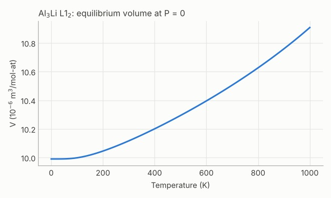
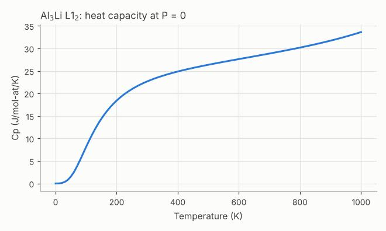
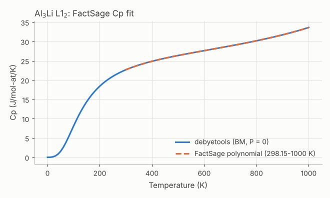
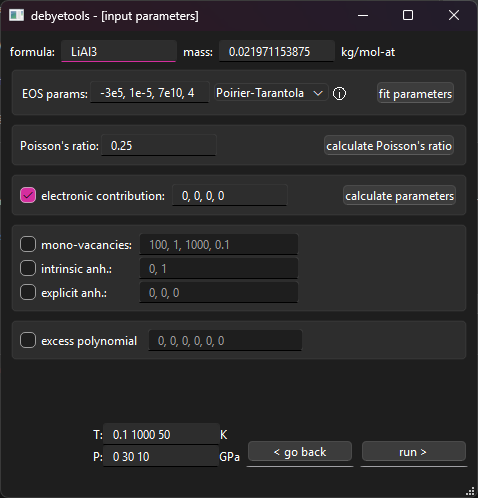
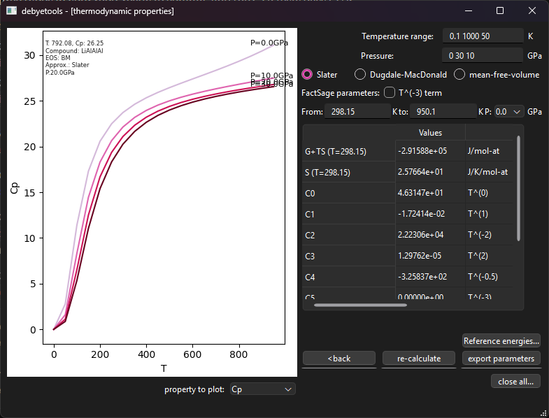

.. _examples:

========
Examples
========

.. contents:: Table of contents
   :local:
   :backlinks: none
   :depth: 3

Al\ :sub:`3`\ Li L1\ :sub:`2`\  thermodynamic properties
========================================================

To calculate the thermodynamic properties of an element or compound, we first parametrize the function that
describes its internal energy. Here the third-order Birch-Murnaghan equation of state (``BM``) is fitted to the
DFT energy-volume data loaded with ``load_V_E`` (the VASP energies extrapolated to zero smearing, ``E0=``; see
:ref:`fileformats`). The module ``potentials`` holds all the implemented EOS; ``fitEOS``
fits the parameters to (volume, energy) data and returns them (E0, V0, K0, K0'). All quantities are SI per mole
of atoms. The VASP results for Al\ :sub:`3`\ Li L1\ :sub:`2`\  are shipped with the package:

>>> import os
>>> import debyetools
>>> folder = os.path.join(os.path.dirname(debyetools.__file__), 'examples', 'Al3Li_L12')

Loading the energy curve and fitting the Birch-Murnaghan EOS:

>>> from debyetools.aux_functions import load_V_E
>>> import debyetools.potentials as potentials
>>> V_DFT, E_DFT = load_V_E(folder + '/SUMMARY', folder + '/CONTCAR', units='J/mol')
>>> eos_BM = potentials.BM()
>>> p_EOS = eos_BM.fitEOS(V_DFT, E_DFT)
>>> print(', '.join('%.4e' % p for p in p_EOS))
-3.2645e+05, 9.8233e-06, 6.3223e+10, 4.3026e+00

The electronic contribution uses the density of states at the Fermi level. The DOSCAR of each volume of
``V_DFT`` (same order) is read with ``load_doscar`` (total DOS, spins summed, per atom) and N(E\ :sub:`F`) is
fitted to a cubic polynomial in V with ``fit_electronic`` (linear least squares; the second argument is not used):

>>> from debyetools.aux_functions import load_doscar
>>> from debyetools.electronic import fit_electronic
>>> list_filetags = ['%02d' % i for i in range(1, 22)]
>>> E, N, Ef = load_doscar(folder + '/DOSCAR.EvV.', list_filetags=list_filetags)
>>> p_electronic = fit_electronic(V_DFT, None, E, N, Ef)
>>> print(', '.join('%.4e' % q for q in p_electronic))
-1.0588e+00, 4.3832e+05, -4.9644e+10, 1.8880e+15

The Poisson's ratio follows from the elastic moduli matrix of the VASP ``IBRION = 6`` OUTCAR, read with
``load_EM``:

>>> from debyetools.aux_functions import load_EM
>>> from debyetools.poisson import poisson_ratio
>>> nu = poisson_ratio(load_EM(folder + '/OUTCAR_elastic'))
>>> print('%.4f' % nu)
0.2294

The mass is the mean atomic mass of Al\ :sub:`3`\ Li, (3 m\ :sub:`Al` + m\ :sub:`Li`)/4 in kg/mol-at. For
this example the vacancies, the anharmonic terms and the excess term are switched off:

>>> m = (3 * 26.9815385 + 6.94) / 4 / 1000
>>> print('%.6f' % m)
0.021971
>>> Tmelting = 933
>>> p_defects = 1e10, 0, Tmelting, 0.1
>>> p_intanh = 0, 1
>>> p_anh = 0, 0, 0

The temperature dependence of the equilibrium volume is calculated by minimizing the Gibbs energy, here at
P = 0. We first create an ``nDeb`` object and define the temperatures (``gen_Ts`` adds 298.15 K); the
minimization is done by ``nDeb.min_G``, starting from the EOS V0:

>>> from debyetools.ndeb import nDeb
>>> from debyetools.aux_functions import gen_Ts
>>> ndeb_BM = nDeb(nu, m, p_intanh, eos_BM, p_electronic, p_defects, p_anh)
>>> T = gen_Ts(0.1, 1000, 11)
>>> T, V = ndeb_BM.min_G(T, eos_BM.V0, P=0)

The thermodynamic properties are obtained by evaluating the thermodynamic functions with ``nDeb.eval_props``,
which returns a dictionary of arrays:

>>> tprops_dict = ndeb_BM.eval_props(T, V, P=0)
>>> for Ti, Vi, Cpi in zip(T, V, tprops_dict['Cp']):
...     print('%7.2f K  V = %.4e  Cp = %6.2f' % (Ti, Vi, Cpi))
   0.10 K  V = 9.9903e-06  Cp =   0.00
 100.09 K  V = 9.9986e-06  Cp =   8.13
 200.08 K  V = 1.0046e-05  Cp =  18.41
 298.15 K  V = 1.0115e-05  Cp =  22.61
 300.07 K  V = 1.0117e-05  Cp =  22.66
 400.06 K  V = 1.0201e-05  Cp =  24.85
 500.05 K  V = 1.0294e-05  Cp =  26.34
 600.04 K  V = 1.0395e-05  Cp =  27.60
 700.03 K  V = 1.0506e-05  Cp =  28.82
 800.02 K  V = 1.0626e-05  Cp =  30.13
 900.01 K  V = 1.0759e-05  Cp =  31.65
1000.00 K  V = 1.0907e-05  Cp =  33.53

To plot them (the figures use 101 temperatures, ``gen_Ts(0.1, 1000, 101)``):

.. code-block:: python

    from matplotlib import pyplot as plt
    plt.plot(T, V)
    plt.xlabel('Temperature (K)')
    plt.ylabel('V (m$^3$/mol-at)')
    plt.show()

The FactSage Cp polynomial is fitted to the calculated properties between 298.15 and 1000 K (``fit_FS`` returns
a dictionary; see :ref:`fsdb`):

>>> from debyetools.fs_compound_db import fit_FS
>>> FS_db_params = fit_FS(tprops_dict, 298.15, 1000)
>>> for key, values in FS_db_params.items():
...     print(key, ', '.join('%.3e' % v for v in values))
Cp 7.748e+01, -4.441e-02, 3.195e+05, 2.609e-05, -8.210e+02, 0.000e+00
a -9.658e-05, 1.783e-07, 7.247e-02, -1.088e+01
1/Ks 1.598e-11, 3.446e-15, -8.719e-19, 2.328e-21
Ksp 4.479e+00, 1.188e-03

The fitted polynomial against the calculated heat capacity:

Thermodynamic properties with the ``debyetools`` interface
===========================================================

The same calculations as the previous example can be carried out with the ``debyetools`` :ref:`GUI <gui>`.

   ``debyetools`` main window.

The results are plotted in the results window that opens with **run >**; here the number of temperatures was increased from the default to show smoother curves.

   ``debyetools`` results window.

.. _Cp_ga_example:

Genetic algorithm to fit Cp to experimental data
================================================

To show how flexible ``debyetools`` is, we show next a way to fit a thermodynamic property like the heat capacity to experimental data using a genetic algorithm.

.. _GA_fig:
.. figure:: ./images/ga_fig.jpeg
   :align:   center

   Schematics of the fitting of the heat capacity to experimental data.

The example below fits the Murnaghan EOS parameters V0, K0, K0', the Poisson's ratio, the intrinsic and explicit
anharmonicity and the vacancy parameters of LiFePO4 to its experimental heat capacity, with the Dugdale-MacDonald
Debye temperature (``mode='jjdm'``). It is shown as code to adapt rather than to run as is (a genetic algorithm
evaluates the model many times).

First we set the initial values and the experimental data (T in K, Cp in J/mol-at/K):

.. code-block:: python

    import numpy as np
    import numpy.random as rnd
    import debyetools.potentials as potentials
    from debyetools.ndeb import nDeb

    eos_MU = potentials.MU()
    params_Murnaghan = [-6.745375544e+05, 6.405559904e-06, 1.555283892e+11, 4.095209375e+00]
    E0, V0, K0, K0p = params_Murnaghan
    nu = 0.2747222272342077
    a0, m0 = 0, 1
    s0, s1, s2 = 0, 0, 0
    edef, sdef = 20, 0
    V0_ini, K0_ini, K0p_ini, nu_ini = V0, K0, K0p, nu   # kept for the final plot
    T = np.array([126.9565217,147.826087,167.826087,186.9565217,207.826087,226.9565217,248.6956522,267.826087,288.6956522,306.9565217,326.9565217,349.5652174,366.9565217,391.3043478,408.6956522,428.6956522,449.5652174,467.826087,488.6956522,510.4347826,530.4347826,548.6956522,571.3043478,590.4347826,608.6956522,633.0434783,649.5652174,670.4347826,689.5652174,711.3043478,730.4347826,750.4347826,772.173913])
    C_exp = np.array([9.049180328,10.14519906,11.29742389,12.05620609,12.92740047,13.82669789,14.61358314,15.45667447,16.07494145,16.55269321,17.00234192,17.73302108,18.21077283,18.60421546,19.25058548,19.53161593,19.78454333,20.12177986,20.4028103,20.90866511,21.18969555,21.52693208,21.89227166,22.4824356,22.96018735,23.40983607,23.69086651,23.88758782,23.71896956,23.7470726,23.85948478,23.83138173,24.19672131])

The function to evaluate, the heat capacity at the temperatures ``T`` (an array):

.. code-block:: python

    def Cp_LiFePO4(T, params):
        V0, K0, K0p, nu, a0, m0, s0, s1, s2, edef, sdef = params
        p_intanh = a0, m0
        p_anh = s0, s1, s2

        # EOS with the trial parameters (used as given, fit=False)
        eos_MU.fitEOS([V0], [E0], initial_parameters=[E0, V0, K0, K0p], fit=False)

        p_electronic = [0, 0, 0, 0]
        Tmelting = 800
        p_defects = edef, sdef, Tmelting, 0.1
        m = 0.02253677142857143

        ndeb_MU = nDeb(nu, m, p_intanh, eos_MU, p_electronic, p_defects, p_anh, mode='jjdm')
        T_ok, V = ndeb_MU.min_G(T, V0, P=0)
        if len(T_ok) < len(T):
            raise ValueError('no stable volume above %.1f K' % T_ok[-1])  # min_G stops at the last stable T
        return ndeb_MU.eval_props(T_ok, V, P=0)['Cp']

The genetic algorithm: ``mutate`` varies the parameters, ``mate`` combines two parent sets, ``evaluate`` is the
error against the experiment (a failed evaluation counts as a large error) and ``select_bests`` keeps the best
sets:

.. code-block:: python

    def mutate(params, n_children, mrate, mvar):
        res = []
        for i in range(n_children):
            new_params = []
            for pi, mvars in zip(params, mvar):
                if rnd.randint(0, 100) / 100. <= mrate:
                    step = mvars[1] / 10
                    lst1 = np.arange(mvars[0] - mvars[1], mvars[0] + mvars[1] + step, step)
                    new_params.append(lst1[rnd.randint(0, len(lst1))])
                else:
                    new_params.append(pi)
            res.append(new_params)
        return res

    def evaluate(fc, T, pi, yexp):
        try:
            return np.sqrt(np.sum((fc(T, pi) / T - yexp / T) ** 2))
        except Exception:
            return 1e10

    def select_bests(fn, T, params, ngen, yexp):
        errs = np.array([evaluate(fn, T, pi, yexp) for pi in params])
        best = np.argsort(errs)[:ngen]
        return [params[j] for j in best], [errs[j] for j in best]

    def mate(params, ngen, mvar):
        res = [params[0], params[1]]
        for i in range(int(max(2, ngen - 2) / 2)):
            cutsite = rnd.randint(0, len(params[0]))
            res.append(mutate(params[0][:cutsite] + params[1][cutsite:], 1, 0.5, mvar)[0])
            res.append(mutate(params[1][:cutsite] + params[0][cutsite:], 1, 0.5, mvar)[0])
        return res

The iterations (1) mate the parents, (2) evaluate the children and (3) keep the best two as the new parents,
until the best error has not changed for 20 generations or ``max_iter`` is reached:

.. code-block:: python

    mvar = [(V0, V0*0.01), (K0, K0*0.05), (K0p, K0p*0.01), (nu, nu*0.01), (a0, 5e-6), (m0, 5e-3),
            (s0, 5e-5), (s1, 5e-5), (s2, 5e-5), (edef, 0.5), (sdef, 0.1)]
    parents_params = mutate([V0, K0, K0p, nu, a0, m0, s0, s1, s2, edef, sdef], n_children=2, mrate=0.7, mvar=mvar)
    ix, max_iter, counter_change, errs_old = 0, 500, 0, 1
    while ix <= max_iter:
        children_params = mate(parents_params, 10, mvar)
        parents_params, errs_new = select_bests(Cp_LiFePO4, T, children_params, 2, C_exp)
        V0, K0, K0p, nu, a0, m0, s0, s1, s2, edef, sdef = parents_params[0]
        mvar = [(V0, V0*0.05), (K0, K0*0.05), (K0p, K0p*0.05), (nu, nu*0.05), (a0, 5e-6), (m0, 5e-3),
                (s0, 5e-5), (s1, 5e-5), (s2, 5e-5), (edef, 0.5), (sdef, 0.1)]
        counter_change = counter_change + 1 if errs_old == errs_new[0] else 0
        errs_old = errs_new[0]
        ix += 1
        if counter_change >= 20:
            break
    best_params = parents_params[0]

The result can be plotted with matplotlib against the experiment (and, here, a phonon calculation):

.. code-block:: python

    from matplotlib import pyplot as plt

    T_calc = np.linspace(0.1, 800, 51)
    plt.plot(T, C_exp, 'o', label='exp')
    plt.plot(T_calc, Cp_LiFePO4(T_calc, [V0_ini, K0_ini, K0p_ini, nu_ini, 0, 1, 0, 0, 0, 20, 0]), label='Murnaghan')
    plt.plot(T_calc, Cp_LiFePO4(T_calc, best_params), label='Murnaghan + fitted')
    plt.xlabel('Temperature (K)')
    plt.ylabel('Cp (J/mol-at/K)')
    plt.legend()
    plt.show()

The resulting figure is:

.. figure::  ./images/Cp_LiFePO4.jpeg
   :align:   center

   LiFePO4 heat capacity.

.. _PvT_example:

Simultaneous parameter adjusting to experimental heat capacity and thermal expansion at P = 0 and prediction of thermodynamic phase equilibria at high pressure
===============================================================================================================================================================

Similarly to the previous example, a genetic algorithm was used to adjust the model parameters to experimental
data. The compound studied was Mg\ :sub:`2`\ SiO\ :sub:`4`\  in the α, β and γ phases (forsterite, wadsleyite and
ringwoodite) with structures Pnma, Imma and Fd-3m, respectively, for temperatures from 0 to 2500 K and pressures
from 0 to 30 GPa. The isobaric heat capacity and the thermal expansion were fitted simultaneously at P = 0, so the
objective function returns both (same structure as ``Cp_LiFePO4``, with the parameters of each phase):

.. code-block:: python

    def Cp_a_Mg2SiO4(T, params):
        V0, K0, K0p, nu, a0, m0, s0, s1, s2, edef, sdef = params
        eos_MU.fitEOS([V0], [E0], initial_parameters=[E0, V0, K0, K0p], fit=False)
        ndeb_MU = nDeb(nu, m, (a0, m0), eos_MU, [0, 0, 0, 0], (edef, sdef, Tmelting, 0.1), (s0, s1, s2),
                       mode='jjdm')
        T_ok, V = ndeb_MU.min_G(T, V0, P=0)
        if len(T_ok) < len(T):
            raise ValueError('no stable volume above %.1f K' % T_ok[-1])
        tprops_dict = ndeb_MU.eval_props(T_ok, V, P=0)
        return tprops_dict['a'], tprops_dict['Cp']

The genetic algorithm is the same as in the previous example except for the evaluation function, which now takes
target data for both the thermal expansion and the heat capacity (``T_set1``, ``T_set2``: their temperatures):

.. code-block:: python

    def evaluate(fc, T_set1, T_set2, pi, yexp, yexp2):
        try:
            alpha = fc(T_set1, pi)[0]
            Cp = fc(T_set2, pi)[1]
            err1 = np.sqrt(np.sum(((alpha - yexp) / yexp) ** 2)) / len(T_set1)
            err2 = np.sqrt(np.sum(((Cp - yexp2) / yexp2) ** 2)) / len(T_set2)
            return err1 + err2
        except Exception:
            return 1e10

Once the optimal parameters of the three phases are obtained (one ``nDeb`` object per phase: ``ndeb_alpha``,
``ndeb_beta``, ``ndeb_gamma``), the thermodynamic properties are calculated as functions of temperature and
pressure; for each phase:

.. code-block:: python

    from debyetools.aux_functions import gen_Ts, gen_Ps

    Ts = gen_Ts(0.1, 2500, 100)
    Ps = gen_Ps(0, 30e9, 31)

    def props_TP(ndeb, V0):
        tprops = []
        for P in Ps:
            T, V = ndeb.min_G(Ts, V0, P=P)      # equilibrium volume at each T (stops at the last stable T)
            tprops.append(ndeb.eval_props(T, V, P=P))
        return tprops

    tprops_alpha = props_TP(ndeb_alpha, V0_alpha)
    tprops_beta = props_TP(ndeb_beta, V0_beta)
    tprops_gamma = props_TP(ndeb_gamma, V0_gamma)

Each list holds, for each pressure, the dictionary of properties; the Gibbs energy is the key ``'G'``. The stable
phase at each (T, P) is the one with the lowest G (1 = α, 2 = β, 3 = γ):

.. code-block:: python

    G_z = np.zeros((len(Ts), len(Ps)))
    for i in range(len(Ts)):
        for j in range(len(Ps)):
            G_list = [tprops_alpha[j]['G'][i], tprops_beta[j]['G'][i], tprops_gamma[j]['G'][i]]
            G_z[i, j] = G_list.index(min(G_list)) + 1

(this assumes every phase is stable at every (T, P); otherwise compare only the temperatures that ``min_G``
returned for all three).

This can be plotted in a P vs T predominance diagram:

.. figure::  ./images/Mg2SiO4_PvT.jpeg
   :align:   center

   Phase diagram P versus T for the α, β and γ forms of Mg2SiO4. Symbols are literature data for the phase stability regions
   boundaries.
