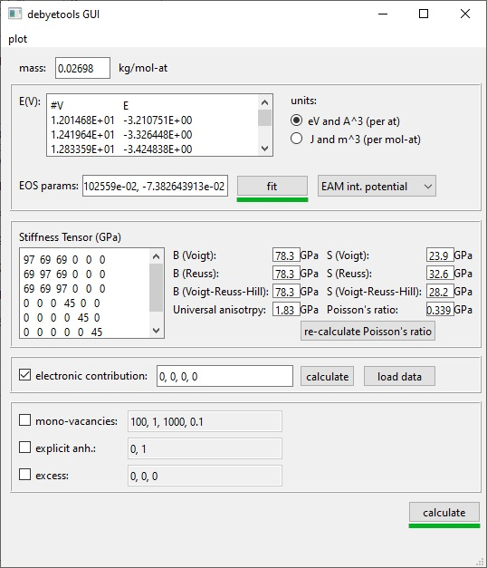

.. _gui:

===
GUI
===

.. contents:: Table of contents
   :local:
   :backlinks: none
   :depth: 3

General Overview
================
The interface is a GUI that allows to easily parametrize the Free energy and calculate the thermodynamic properties. It is organized in two main level, (1) GUI, and (2) calculation engine. The GUI will receive the user defined options and/or parameter values and will launch the calculations and display the results.The user level part of the software is divided in four modules: (1) parametrization, (2) free energy minimization,(3) evaluation of thermodynamic properties, and (4) calculation of the database parameters.

Note that in this version, most :ref:`input file <fileformats>` must be in VASP_ format, i.e., CONTCAR for the crystal structure, and DOSCAR for the calculation of the electronic contribution. Also, the elastic moduli matrix  is  read  from  an  OUTCAR  file.

How to launch it:
-----------------

To start getting familiar with the interface you can download `examples input files`_.
The GUI can be launched by executing the interface script from the debyetools repository main folder::

$ python interface.py

Or you can launch  inside python:

>>> from debyetools.tpropsgui.gui import interface
>>> interface()

The interface main window:
--------------------------

The model parametrization is done in the main window.

.. _interface_mainindow:

   ``debyetools`` interface main window.

The properties viewer
---------------------

The calculation results are shown in this window.

.. _interface_prop:
.. figure::  ./images/property_interface.jpeg
   :align:   center

   ``debyetools`` properties viewer.

Parametrization
===================

The parameters of all contributions are entered and/or calculated in this module. The mass is entered as :math:`kg/mol-at`. EOS parameters can be fitted for the internal energy if the energy curve and initial guess for the parameters are given. The EOS to be used can be selected from a drop-down list. For the selected EOS/potential, the fitting of the parameters is carried out if the ‘fit’ option is selected, otherwise, the parameters entered manually are used.

V(T)
====

After the parametrization is complete, the temperature dependence of the equilibrium volume is carried out when clicking the button 'calculate'. Once the input parameters have been entered and/or calculated, it is possible to proceed to the calculation of the volume as a function of temperature through free energy minimization. Default values for pressure and temperature are used the first time the calculation is carried out, with pressures from :math:`0` to :math:`30 GPa` and temperatures from :math:`0.1` to :math:`1000.1 K`.
An energy minimization will be performed at each temperature and each pressure. The calculated volume as a function of temperature and pressure is stored for the evaluation of the thermodynamic properties.

Thermodynamic Properties
========================

The evaluation of the thermodynamic properties can be performed in this module for the list of triplets :math:`(T,V,P)` from the previous part.  Each individual property can be selected from a drop-down menu to be plotted.

In the results visualization window properties are evaluated and shown as a function of temperature and pressure. By default is the heat capacity that is presented but the available properties can be selected from a drop-down menu. Note that right-clocking in the figure allows to copy the data to the clipboard. The defined pressure and temperature range can be modified from default values. The default setting performs calculations using the Slater approximation for the Debye temperature but the calculations can be performed using also the Dugdale-Macdonald or mean-free volume theory approximations. The FactSace compound database parameters are also presented in this view for each pressure, for the chosen range of temperature. If the setting are changed, the calculation can be re-run clicking 're-calculate'.

FS compound database parameters.
================================

The calculated thermodynamic properties for each EOS selected are used to fit the models for heat capacity, thermal expansion,  bulk modulus and pressure derivative of the bulk modulus.   The resulting parameters are printed in the GUI to be used in FactSage as a compound database.

.. _VASP: https://www.vasp.at/
.. _`examples input files`: https://github.com/jjofres/debyetools/tree/main/tests/inpt_files
