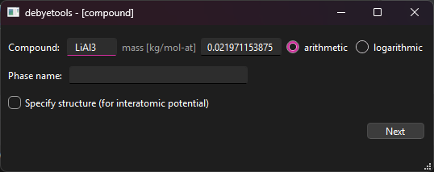
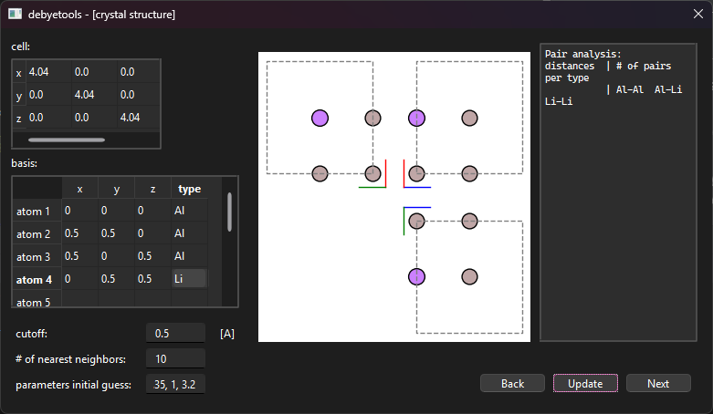
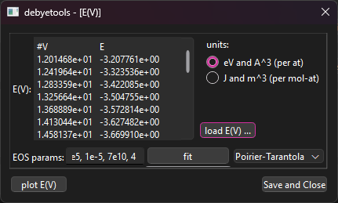
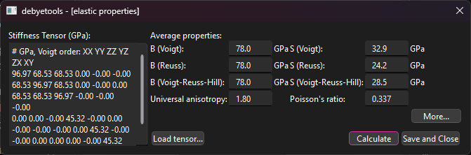
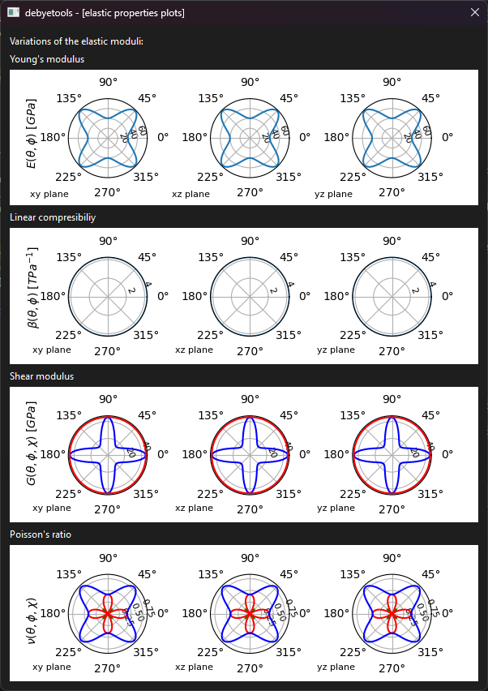
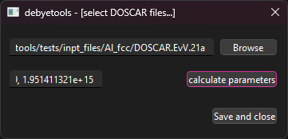
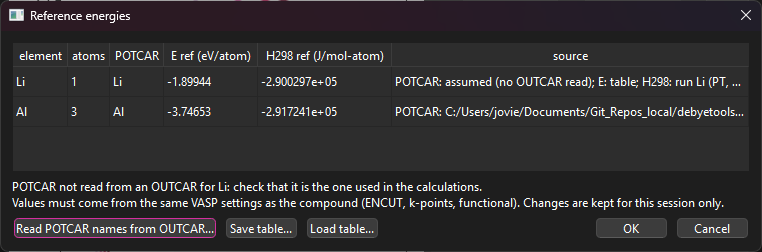

.. _gui:

===
GUI
===

.. contents:: Table of contents
   :local:
   :backlinks: none
   :depth: 3

General overview
================

The graphical interface parametrizes the free energy, runs the calculation and shows the results without
writing scripts. It uses the same calculation engine as the library (``debyetools.ndeb.nDeb``); all values are per
mole of atoms unless stated otherwise. Most input files are VASP results (see :ref:`input file formats
<fileformats>`): SUMMARY and CONTCAR for the energy curve, DOSCAR files for the electronic contribution and an
``IBRION = 6`` OUTCAR for the elastic constants. Example input files are in ``debyetools/examples`` and in the
`examples input files`_ of the repository.

How to launch it
----------------

From the repository main folder::

    $ python dtgui.py

or inside Python:

>>> from debyetools.tpropsgui.gui import dtgui    # doctest: +SKIP
>>> dtgui()                                         # doctest: +SKIP

Messages (fit restarts, truncated temperature ranges, missing references, …) are shown in message boxes; errors
are also printed to the console.

Start window
============

* **Compound**: click the field to open the periodic table and set the number of atoms of each element in the
  formula unit.
* **mass [kg/mol-at]**: filled from the formula, as the arithmetic (default) or the logarithmic mean of the atomic
  masses (radio buttons next to the field; the logarithmic mean is recommended by Lu et al. (2007) for large mass
  differences).
* **Specify structure (for interatomic potential)**: tick it to describe the internal energy with the Morse or EAM
  potential; the crystal dialog opens with **Next**. Without it, the analytic EOS are offered (Birch-Murnaghan,
  Rose-Vinet, Mie-Gruneisen, TB-SMA, Murnaghan, Poirier-Tarantola).

   Start window: compound, mean atomic mass (arithmetic or logarithmic) and the structure option.

Crystal structure (Morse, EAM)
------------------------------

Enter the cell (Å), the fractional basis with the element of each atom, the cut-off radius (Å) and the number of
neighbour shells, then **Update**: the cell is drawn, the pair analysis is listed (distances and number of pairs per
pair type) and the default initial parameters of the potential are written (Morse: 3 per pair type; EAM: 6 per pair
type and 4 per element type). **Next** opens the main window with Morse and EAM in the EOS list.

   Crystal structure dialog (for the Morse and EAM potentials): cell, basis, cut-off and pair analysis.

Main window: parametrization
============================

* **EOS params**: the parameters of the selected EOS, typed or obtained with **fit parameters**. Selecting another
  EOS writes its default start (for Morse and EAM, the one for the crystal's pair types).
* **Poisson's ratio**: typed or obtained with **calculate Poisson's ratio**.
* **electronic contribution** (q0 … q3 of N(E\ :sub:`F`)(V)), **mono-vacancies** (Evac00, Svac00, Tm, a),
  **intrinsic anh.** (a0, m0), **explicit anh.** (s0, s1, s2) and **excess polynomial** (xs0 … xs5): each term is
  used only when its box is ticked; missing trailing coefficients are zero (see :ref:`contributions
  <contributions>` for the definitions and units).
* **T** and **P**: ``start end step`` in K and GPa (a single value is allowed); **run >** opens the results window.

.. figure:: ./images/gui_main_window.png
   :align: center
   :width: 60%

   Main window: EOS, Poisson's ratio, contributions and the temperature and pressure grids.

EOS fit
-------

Paste the energy curve as two columns (V, E) or load it with **load E(V) ...** from a SUMMARY and a POSCAR/CONTCAR
file, choose the units (**eV and A^3 (per at)** or **J and m^3 (per mol-at)**) and **fit**. The analytic EOS need
no initial parameters; if a fit is not acceptable, other starting points are tried, and when none passes the dialog
asks whether to keep the best attempt. **plot E(V)** compares the fit with the data; **Save and Close** copies the
parameters to the main window. EAM fits of compounds can take a minute or more, during which the window does not
respond.

   EOS fit dialog: energy-volume data loaded from a SUMMARY and a CONTCAR.

Poisson's ratio and elastic properties
--------------------------------------

Paste the stiffness tensor in GPa (Voigt order XX, YY, ZZ, YZ, ZX, XY) or load it with **Load tensor...** from an
OUTCAR (converted from kBar and from the VASP order; the POTCAR names in the OUTCAR are also kept for the
reference energies). **Calculate** gives the Voigt, Reuss and Hill bulk and shear moduli, the universal anisotropy
index and the Poisson's ratio. **More...** opens a report (eigenvalues of the stiffness matrix, averages, minimum
and maximum of the Young's modulus, linear compressibility, shear modulus and Poisson's ratio with their directions)
and **Plots** draws them in the xy, xz and yz planes (negative values in green, as magnitudes).

   Elastic properties dialog: stiffness tensor (GPa, Voigt order) and averages.

   Directional elastic properties (Young's modulus, linear compressibility, shear modulus, Poisson's ratio).

Electronic contribution
-----------------------

**calculate parameters** next to the electronic contribution opens a dialog to select the DOSCAR files (one per
volume, in any order: each file is paired with the volume written in it) and fits N(E\ :sub:`F`)(V). If E(V) data
were entered in the EOS fit, the volumes are cross-checked.

   DOSCAR dialog: the selected DOSCARs and the fitted N(E\ :sub:`F`)(V) parameters.

Results window
==============

The equilibrium volume is calculated at each temperature and pressure and the properties are evaluated. The
property to plot is chosen from a list, with one curve per pressure; right-clicking the figure copies the data to
the clipboard. The temperature and pressure ranges and the Debye-temperature model (**Slater**,
**Dugdale-MacDonald**, **mean-free-volume**) can be changed and the calculation repeated with **re-calculate**.
When no stable volume exists beyond some temperature, the calculation stops there and a message says so.

The table shows, for the selected pressure, per mol-atom: G + TS and S at 298.15 K and the FactSage heat-capacity
coefficients C0 … C5 fitted between **From** and **to** (the T\ :sup:`-3` term only when its box is ticked), and,
per formula unit, the values exported for the FactSage Compound module:

* **H298**: the enthalpy of formation ΔH298 = H\ :sub:`compound`\ (298.15) − Σ n\ :sub:`i` H\ :sub:`i`\ (298.15).
  The element references H\ :sub:`i` are the results of pure-element runs made in the same session (same POTCAR and
  settings, P = 0) or values entered in **Reference energies...**; without them the static formation energy
  E0(V0) − Σ n\ :sub:`i` E\ :sub:`i` is exported and a message says so.
* **S298**: the entropy at 298.15 K.

**export parameters** writes the formula, H298, S298, the Cp coefficients and the temperature window to the file
``export_dtoutput4cmpnd`` (the same content is written to ``dtoutput4cmpnd`` after every run), in the working
folder.

.. figure:: ./images/gui_cp_window.png
   :align: center
   :width: 90%

   Results window: properties at each pressure, FactSage parameters and export.

Reference energies
------------------

**Reference energies...** lists, for each element of the formula, the POTCAR (read from an OUTCAR, or assumed to be
the element symbol), the static reference energy E ref (eV/atom; built-in values for many PAW_PBE POTCARs) and the
reference enthalpy H298 ref (J/mol-atom). Values can be edited for the session, saved to and loaded from a CSV file
(**Save table...**, **Load table...**; file format and a script for placeholder values in
``debyetools/tpropsgui/reference_tables``), and the POTCAR names can be read from an OUTCAR. The references must
come from calculations with the same settings as the compound, and E ref is the energy at zero smearing (VASP's
``E0=``, the value ``load_V_E`` reads; the built-in values follow this convention).
Placeholder values from the Materials Project are in ``reference_tables/mp_placeholders_PBE.csv``; for H, N, O, F
and Cl they are uncorrected PBE energies (O\ :sub:`2` overbinding: oxide formation energies too negative by about
0.7 eV per O atom; see the README in that folder).

   Reference energies dialog: POTCAR, static reference energy and H298 reference of each element.

.. _VASP: https://www.vasp.at/
.. _`examples input files`: https://github.com/jjofres/debyetools/tree/main/tests/inpt_files
