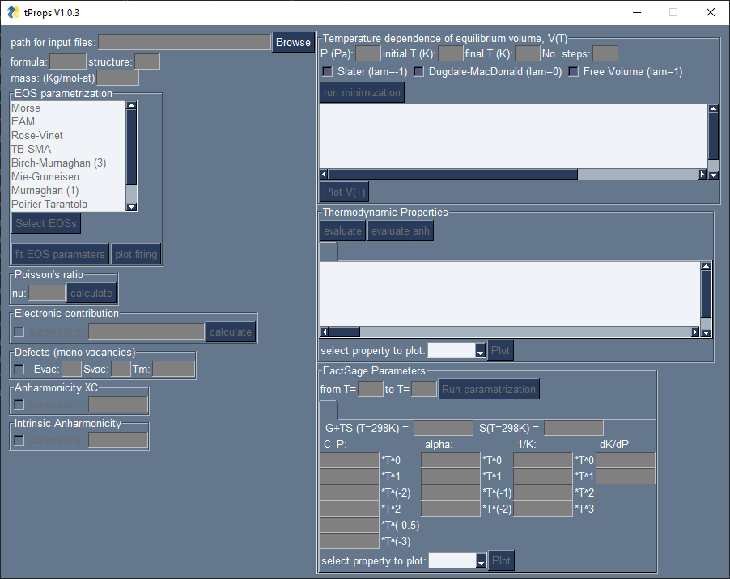
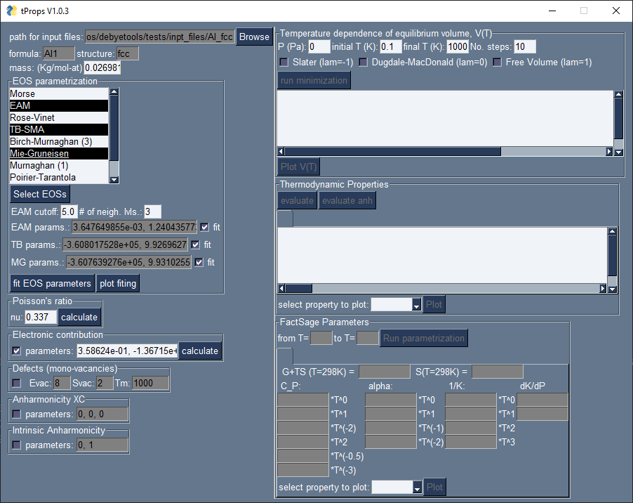
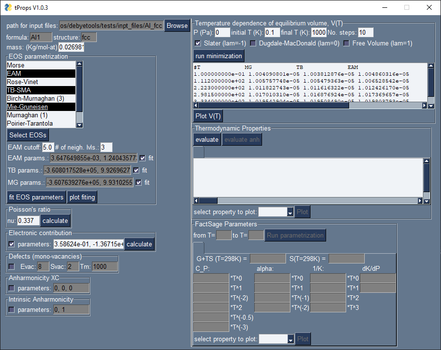
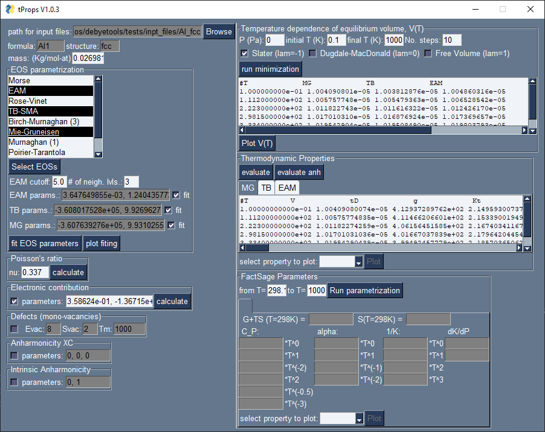
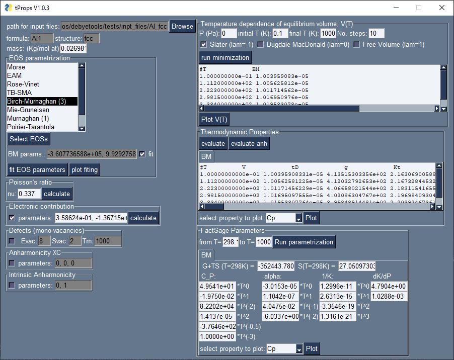

.. _gui:

===
GUI
===

General Overview
================
``tProps`` is a GUI that allows to easily parametrize the Free energy and calculate the thermodynamic properties. It is organized in two main level, (1) GUI, and (2) calculation engine. The GUI will receive the user defined options and/or parameter values and will launch the calculations and display the results.The user level part of the software is divided in four modules: (1) parametrization, (2) free energy minimization,(3) evaluation of thermodynamic properties, and (4) calculation of the database parameters.

Note that in this version, most input files must be in VASP_ format, i.e., CONTCAR for the crystal structure, and DOSCAR for the calculation of the electronic contribution. Also, the elastic moduli matrix  is  read  from  an  OUTCAR  file  and  the E(V)data  is  read  from  a  SUMMARY  file  which contains the total energy at each deformation.

How to launch it:
-----------------

The GUI can be launched by executing the interface script from the debyetools repository main folder::

$ python gui.py

Or you can launch  inside python:

>>> from debyetools.tpropsgui.gui import gui
>>> gui()

The interface:
--------------

.. _tProps:

   tProps v0.0

EOS Parametrization
===================

The parameters of all contributions are entered and/or calculated in this module.  Parameters will be fitted for the internal energy, for each selected EOS/potential (the user has the freedom to choose more than one EOS/potentials, simultaneously), if the 'fit' option is selected. The atom positions and energy as function of volume must be provided.

.. _tProps_EOS_parametrization:

   Parametrization: this figure shows the selection of different potentials, their fits and parameters for the other contributions.

V(T)
====

The calculation of the temperature dependent volume is carried out by minimizing the free energy at fixed temperatures from T=0.1 to melting temperature. The temperature are chozen from a equi-spaced list. The resulting volume and temperatures are returned and printed to the GUI accordingly.

.. _tProps_F_min:

   Free energy minimization.

Thermodynamic Properties
========================

The thermodynamic functions are evaluated at the temperatures and volumes obtained in the minimization part and printed to a multiline text box in an individual tab for each corresponding EOS chosen.

.. _tProps_eval:

   Evaluation of the thermodynamic properties.

FS compound database parameters.
================================

The calculated thermodynamic properties for each EOS selected are used to fit the models for heat capacity, thermal expansion,  bulk modulus and pressure derivative of the bulk modulus.   The resulting parameters are printed in the GUI to be used in FactSage as a compound database.

.. _tProps_FSparams:

   FactSage compound database parameters.

.. _VASP: https://www.vasp.at/
