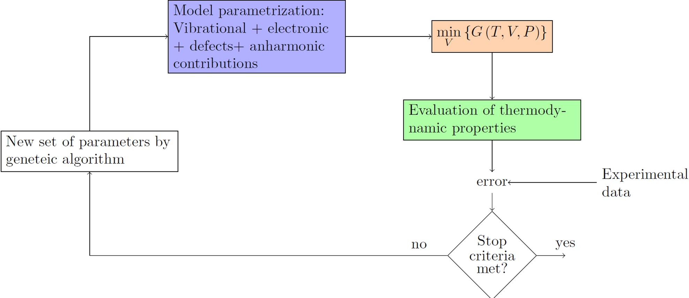
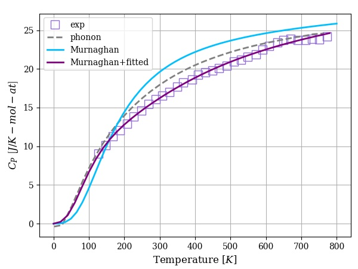
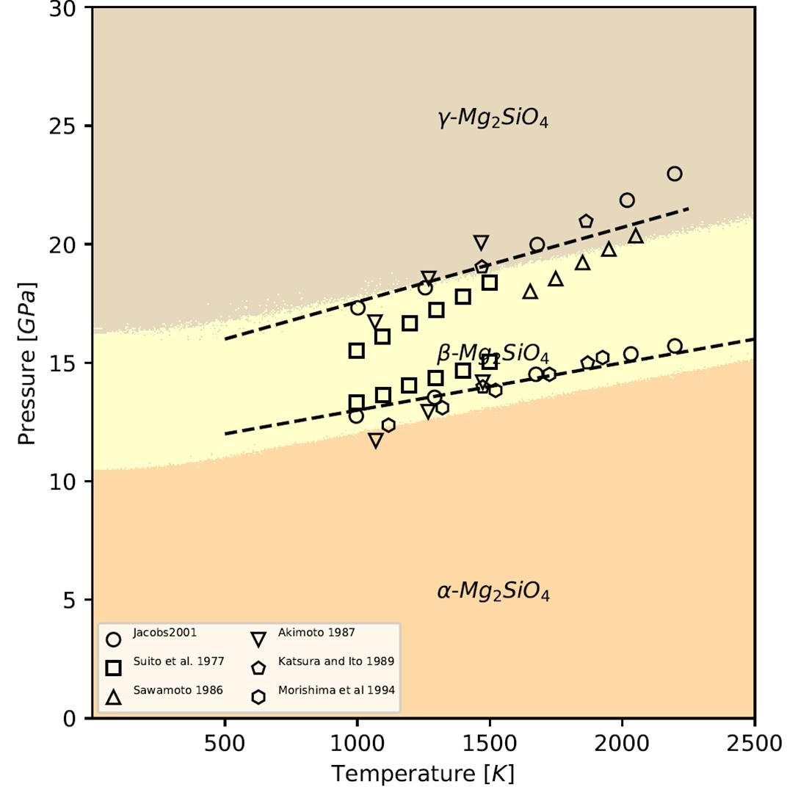
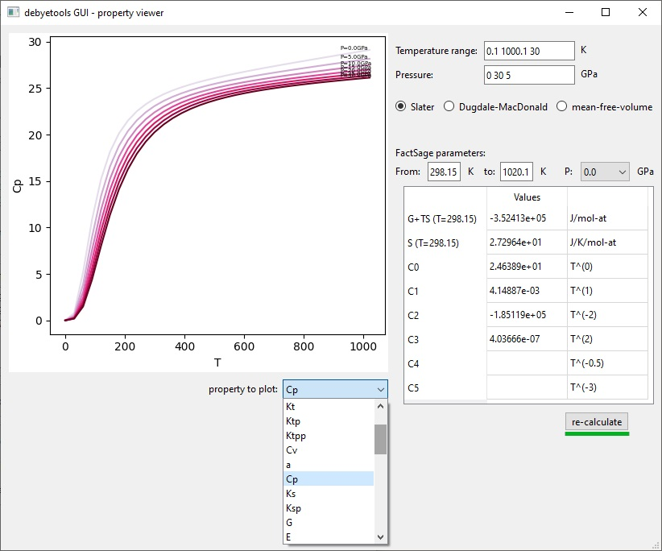

.. _overview:

========
Overview
========

How to cite
-----------

If you use ``debyetools`` in a publication, please refer to the `source code`_.  If you use the implemented method for the calculation of the thermodynamic properties, please cite the following publication:

Jofre, J., Gheribi, A. E., & Harvey, J.-P. Development of a flexible quasi-harmonic-based approach for fast generation of self-consistent thermodynamic properties used in computational thermochemistry. Calphad 83 (2023) 102624. doi: `10.1016/j.calphad.2023.102624`_.

.. code-block::

   @article{,
      author = {Javier Jofré and Aïmen E. Gheribi and Jean-Philippe Harvey},
      doi = {10.1016/j.calphad.2023.102624},
      issn = {03645916},
      journal = {Calphad},
      month = {12},
      pages = {102624},
      title = {Development of a flexible quasi-harmonic-based approach for fast generation of self-consistent thermodynamic properties used in computational thermochemistry},
      volume = {83},
      year = {2023},
   }

Calculate quality thermodynamic properties in a flexible and fast manner
------------------------------------------------------------------------

It's possible to couple the Debye model to other algorithms, to :ref:`fit experimental data <Cp_ga_example>` and in this way use data available to calculate other properties like thermal expansion, free energy, bulk modulus among many others.

   ``debyetools`` coupled to a Genetic Algorithm.

   Heat capacity of LiFePO4 calculated with ``debyetools`` and compared to other methods.

The prediction of :ref:`thermodynamic phase equilibria at high pressure <PvT_example>` can be performed by simultaneous parameter adjusting to experimental heat capacity and thermal expansion at P = 0.

.. _PvT:

   Phase diagram P versus T for the α, β and γ forms of Mg2SiO4. Symbols are literature data for the phase stability regions
   boundaries.

Using ``debyetools`` through the GUI
------------------------------------

``debyetools`` is a Python_ library that also comes with a graphical user interface to help perform quick calculations without the need to code scripts.

.. Screenshot to replace with the current results window (gui_cp_window.png, see source/api/gui.rst).
.. _tProps_prop:

   ``debyetools`` property viewer.

Using ``debyetools`` as a Python_ library. Example: Al fcc
----------------------------------------------------------

Using ``debyetools`` as a Python_ library adds versatility and expands its usability. The example uses the
VASP results for Al fcc shipped with the package (``debyetools/examples/Al_fcc``). All inputs and outputs are SI
per mole of atoms: V in m\ :sup:`3`/mol-at, energies in J/mol-at, pressures and moduli in Pa, mass in kg/mol-at.

Energy-volume data (``units='J/mol'``; the default ``'eV/atom'`` returns Å\ :sup:`3` and eV per atom) and EOS
parametrization. The analytic EOS need no initial parameters; ``fitEOS`` returns the fitted parameters
(E0, V0, K0, K0'):

>>> import os
>>> import debyetools
>>> from debyetools.aux_functions import load_V_E, load_doscar, load_EM, load_cell, gen_Ts
>>> import debyetools.potentials as potentials
>>> folder = os.path.join(os.path.dirname(debyetools.__file__), 'examples', 'Al_fcc')
>>> V_data, E_data = load_V_E(folder + '/SUMMARY', folder + '/CONTCAR', units='J/mol')
>>> eos = potentials.BM()
>>> p_EOS = eos.fitEOS(V_data, E_data)
>>> print('E0 = %.4e J/mol-at, V0 = %.4e m3/mol-at, K0 = %.4e Pa, K0p = %.3f' % tuple(p_EOS))
E0 = -3.6058e+05 J/mol-at, V0 = 9.9318e-06 m3/mol-at, K0 = 7.7683e+10 Pa, K0p = 4.580

The internal energy can also be described with an interatomic potential (Morse, EAM) built from the crystal
structure; for Morse the parameters are (D, a, r0) per pair type:

>>> formula, cell, basis = load_cell(folder + '/CONTCAR')
>>> morse = potentials.MP(formula, cell, basis, 5, 3)
>>> p_MP = morse.fitEOS(V_data, E_data, initial_parameters=[0.35, 1, 3.2])
>>> print('D = %.4f, a = %.4f, r0 = %.4f; V0 = %.4e m3/mol-at' % (*p_MP, morse.V0))
D = 0.3517, a = 1.0114, r0 = 3.2359; V0 = 9.9608e-06 m3/mol-at

Electronic contribution: the total DOS at the Fermi level of each DOSCAR (one per volume, in the order of
``V_data``) fitted to a cubic polynomial in V:

>>> from debyetools.electronic import fit_electronic
>>> tags = ['%02d' % i for i in range(1, 22)]
>>> E, N, Ef = load_doscar(folder + '/DOSCAR.EvV.', list_filetags=tags)
>>> p_electronic = fit_electronic(V_data, None, E, N, Ef)
>>> print(', '.join('%.4e' % q for q in p_electronic))
4.2770e+00, -6.1244e+05, 3.4610e+09, 1.9514e+15

Poisson's ratio from the elastic moduli of a VASP ``IBRION = 6`` OUTCAR:

>>> from debyetools.poisson import poisson_ratio
>>> nu = poisson_ratio(load_EM(folder + '/OUTCAR_elastic'))
>>> print('%.4f' % nu)
0.3370

Free energy minimization (equilibrium volume at each temperature, here at P = 0) with mono-vacancies
(formation energy 8.46 k\ :sub:`B` T\ :sub:`m`, entropy 1.69 k\ :sub:`B`) and no explicit anharmonicity:

>>> from debyetools.ndeb import nDeb
>>> m = 0.0269815385
>>> p_intanh, p_defects, p_anh = (0, 1), (8.46, 1.69, 933, 0.1), (0, 0, 0)
>>> ndeb = nDeb(nu, m, p_intanh, eos, p_electronic, p_defects, p_anh, mode='jjsl')
>>> T = gen_Ts(0.1, 1000, 11)
>>> T, V = ndeb.min_G(T, eos.V0, P=0)

Evaluation of the thermodynamic properties (a dictionary of arrays, e.g. ``'Cp'`` in J/mol-at/K):

>>> tprops = ndeb.eval_props(T, V, P=0)
>>> for Ti, Vi, Cpi in zip(T, V, tprops['Cp']):
...     print('%7.2f K  V = %.4e  Cp = %6.2f' % (Ti, Vi, Cpi))
   0.10 K  V = 1.0041e-05  Cp =   0.00
 100.09 K  V = 1.0054e-05  Cp =  12.26
 200.08 K  V = 1.0104e-05  Cp =  21.17
 298.15 K  V = 1.0170e-05  Cp =  24.19
 300.07 K  V = 1.0172e-05  Cp =  24.23
 400.06 K  V = 1.0248e-05  Cp =  25.85
 500.05 K  V = 1.0331e-05  Cp =  27.05
 600.04 K  V = 1.0420e-05  Cp =  28.19
 700.03 K  V = 1.0518e-05  Cp =  29.47
 800.02 K  V = 1.0624e-05  Cp =  31.12
 900.01 K  V = 1.0743e-05  Cp =  33.44
1000.00 K  V = 1.0879e-05  Cp =  36.79

FactSage compound-database parameters (heat capacity Cp = c0 + c1 T + c2 T\ :sup:`-2` + c3 T\ :sup:`2` +
c4 T\ :sup:`-1/2` + c5 T\ :sup:`-3`; c5 = 0 unless ``cp_T3=True``):

>>> from debyetools.fs_compound_db import fit_FS
>>> FS_db_params = fit_FS(tprops, 298.15, 1000)
>>> print(', '.join('%.3e' % c for c in FS_db_params['Cp']))
1.803e+02, -1.429e-01, 1.564e+06, 7.288e-05, -2.376e+03, 0.000e+00

.. _Python: https://www.python.org/
.. _`source code`: https://github.com/jjofres/debyetools
.. _`10.1016/j.calphad.2023.102624`: https://doi.org/10.1016/j.calphad.2023.102624
