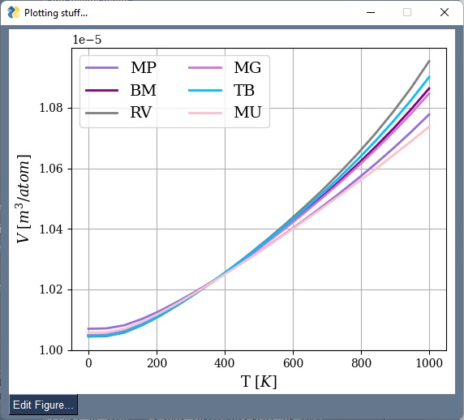
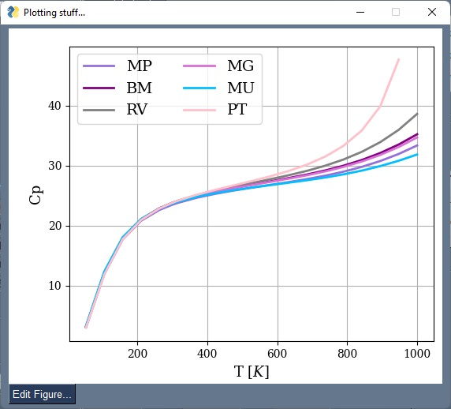
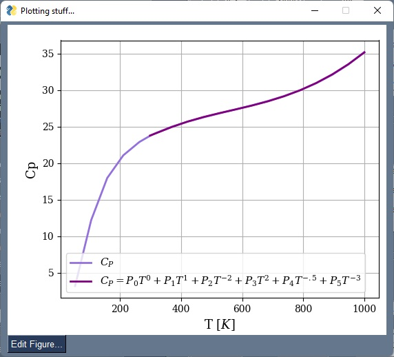

Plotting stuff
==============

EOS fittings
------------

By right-clicking over the 'fit EOS' button is it possible to trigger the pop up of the plot of the EOS fittings.

.. _tProps_EvV:
.. figure::  ./images/E(V)_plot.jpeg
   :align:   center

   E(V) plot.

Free energy minimization
------------------------

After runing the free energy minimization to find the equilibrium volumes the calues can be plotted  as function of temperature.

.. _tProps_VvT:

   Equilibrium volume as function of temperature.

Thermodynamic properties
------------------------

Thermodynamic properties can be chosen from a list of all thermodynamic properties available. Among them are: T, V, tD, g, Kt, Ktp, Ktpp, Cv, a, Cp, Ks, Ksp, F, E, S, E0, Fvib, Evib, Svib, Cvvib, Pcold, dPdT_V, Gamma^2.

.. _tProps_plot:

   Heat capacity.

FS compound database
--------------------

The parametrization of the FS compound database can also be plotted.

.. _tProps_plot_FS:

   Heat capacity.

Figure editing
--------------

There is a figure editor implemented to help edit the figures.

.. _tProps_figedit:
.. figure::  ./images/tprops_figedit.jpeg
   :align:   center

   Figure editor.
