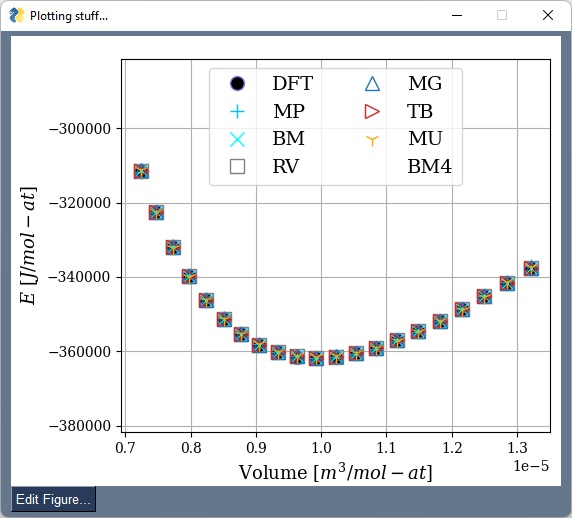
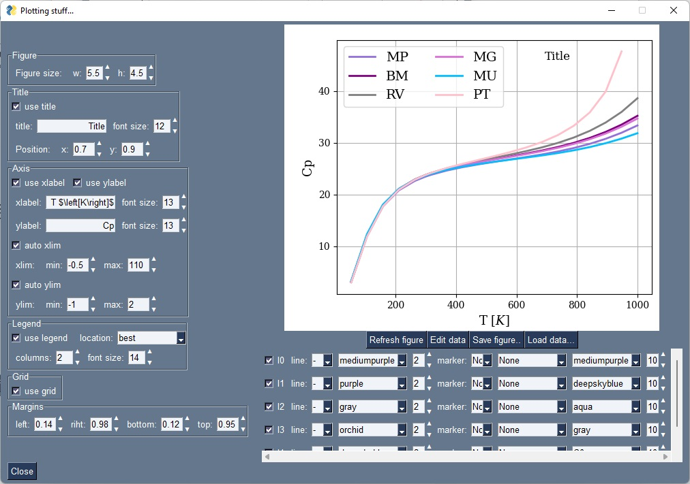

==============
Plotting stuff
==============

.. contents:: Table of contents
   :local:
   :backlinks: none
   :depth: 3

Plotting using the GUI
======================

EOS fittings
------------

By right-clicking over the 'fit EOS' button is it possible to trigger the pop up of the plot of the EOS fittings.

.. _tProps_EvV:

   E(V) plot.

Free energy minimization
------------------------

After runing the free energy minimization to find the equilibrium volumes the calues can be plotted  as function of temperature. 

.. _tProps_VvT:
.. figure::  ./images/V(T)_plot.jpeg
   :align:   center

   Equilibrium volume as function of temperature.

Thermodynamic properties
------------------------

Thermodynamic properties can be chosen from a list of all thermodynamic properties available. Among them are: T, V, tD, g, Kt, Ktp, Ktpp, Cv, a, Cp, Ks, Ksp, F, E, S, E0, Fvib, Evib, Svib, Cvvib, Pcold, dPdT_V, Gamma^2.

.. _tProps_plot:

   Heat capacity.

FS compound database
--------------------

The parametrization of the FS compound database can also be plotted.

.. _tProps_plot_FS:
.. figure::  ./images/tprops_fsparams_plot.jpeg
   :align:   center

   Heat capacity.

Figure editing
--------------

There is a figure editor implemented to help edit the figures.

.. _tProps_figedit:

   Figure editor.

Plotting using the ``plotter`` module
=====================================

Data can also be plotted using code. A ``fig`` object must be intantiated first with the axes labels as arguments:

.. code-block:: python

    import debyetools.tpropsgui.plotter as plot

    fig = plot.fig(r'Temperature$~\left[K\right]$', r'$C_P~\left[J/K-mol-at\right]$')

The data is then added indicidually defining the labels that will go in the legend and if the set will be plotted as `line`, `dash` or `dots`.
The method ``fig.plot`` will launch an interface showing the figure.

.. code-block:: python

    fig.add_set(T_exp, Cp_exp, label = 'exp', type='dots')
    fig.add_set(T_JJ_fit, Cp_JJ_fit, label = 'Murnaghan+fitted', type='line')
    fig.plot()

This will open the following window with the figure:

   LiFePO4 heat capacity.